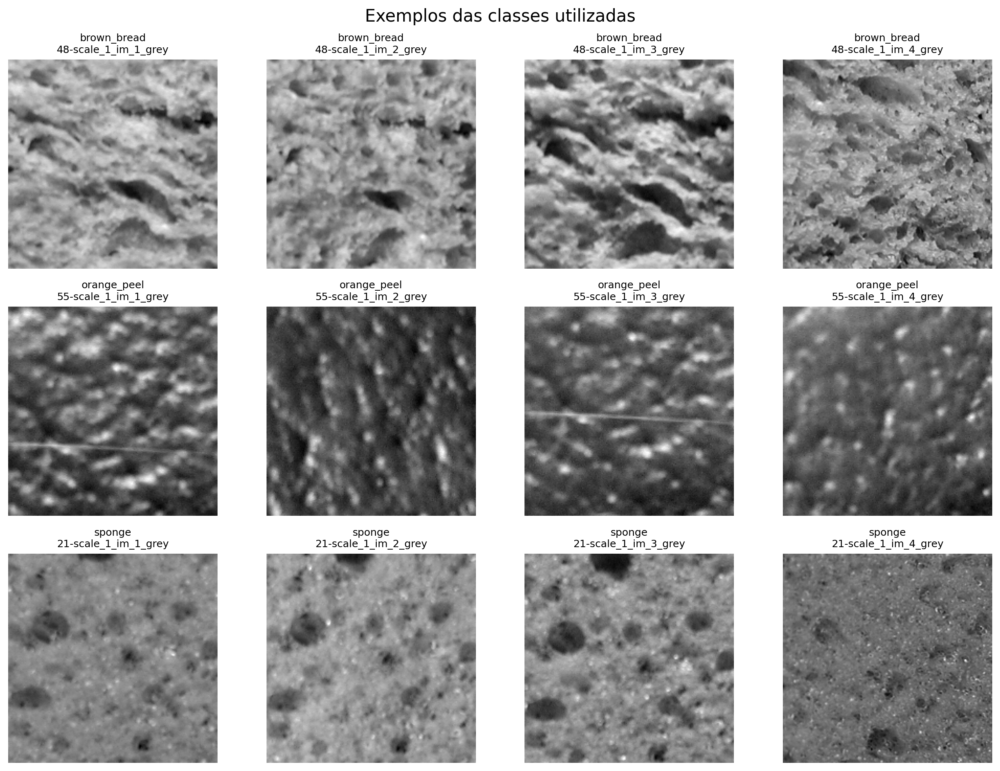
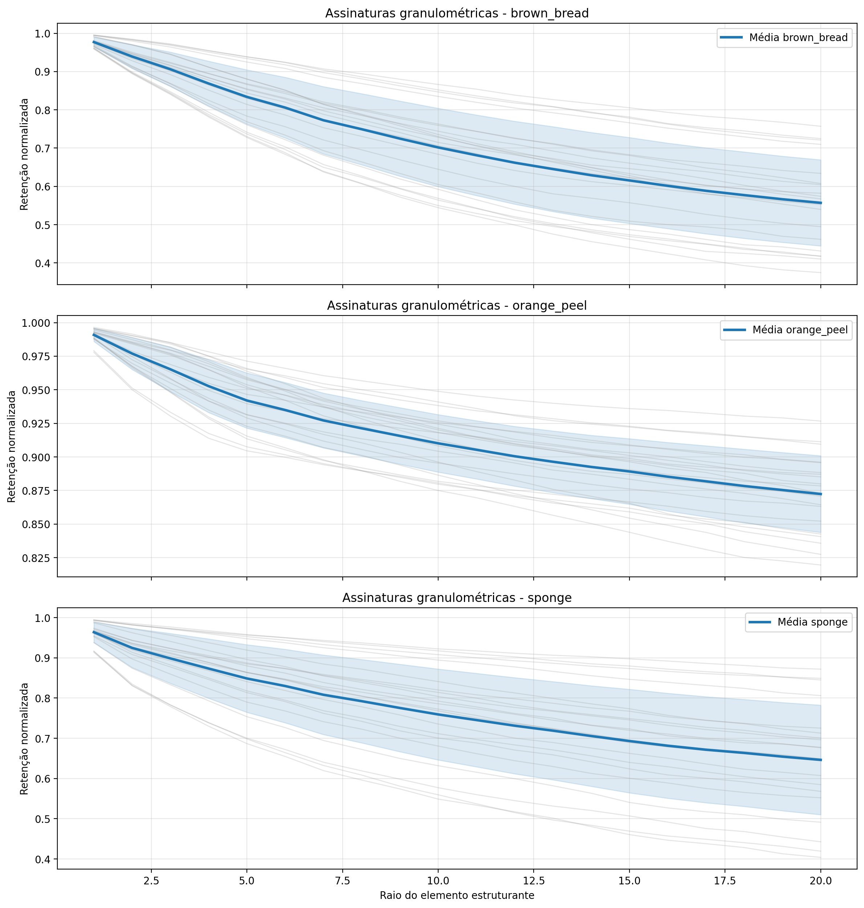
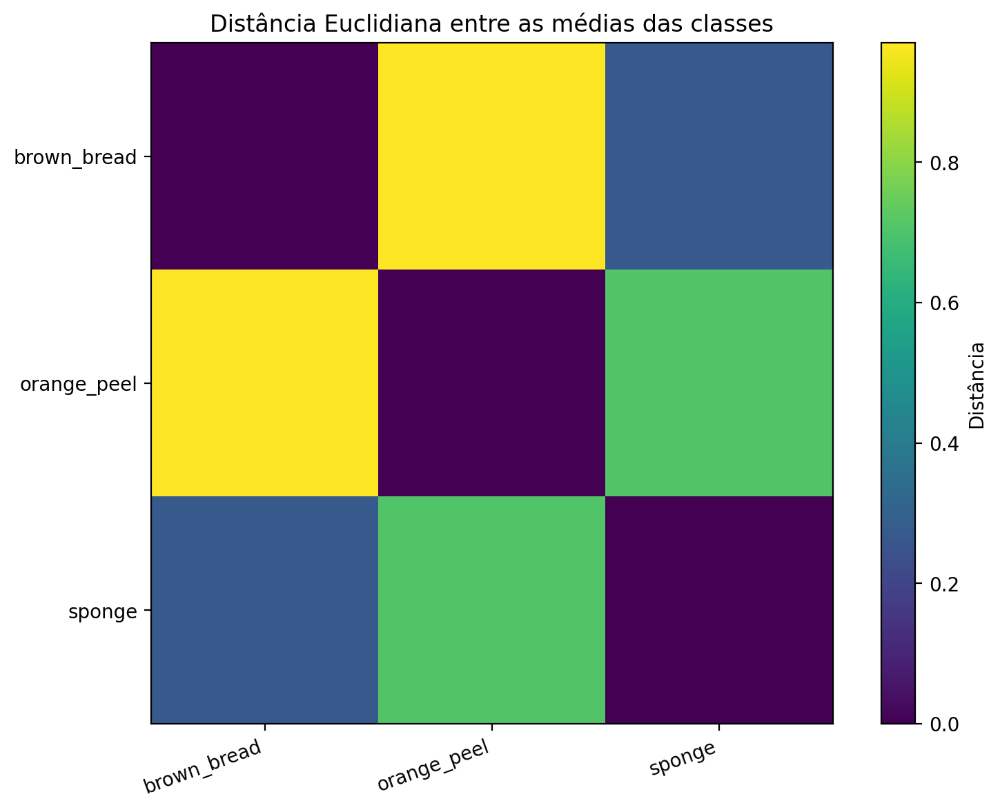
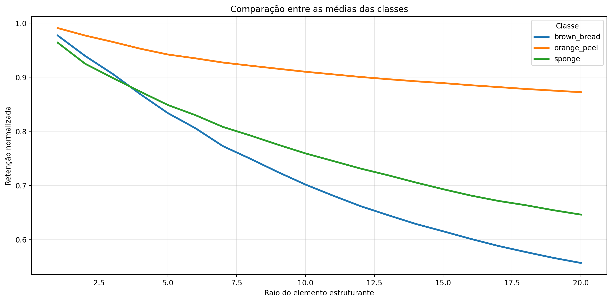

# Laboratório 03 - Granulometria Morfológica

## Resumo executivo

Este relatório apresenta a caracterização morfológica de 60 imagens distribuídas em 3 classes, todas organizadas em [lab03/images](/Volumes/DiscoExterno/doutorado/2026_S1_visao_computacional_python/lab03/images). A análise usa assinaturas granulométricas construídas por aberturas morfológicas com elemento estruturante elíptico e escala variando de 1 a 20 pixels.

## Base de dados

A base utilizada contém 3 classes com 20 imagens por classe, totalizando 60 amostras em tons de cinza e com tamanho padronizado para 200 x 200 pixels.

### Classes analisadas

| class | image_count |
| --- | --- |
| brown_bread | 20 |
| orange_peel | 20 |
| sponge | 20 |

### Exemplos visuais

A figura a seguir mostra exemplos representativos de cada classe usada no experimento.

## Metodologia

Para cada imagem, foram executados os seguintes passos:

1. Leitura em tons de cinza e redimensionamento para o mesmo tamanho.
2. Normalização dos níveis de intensidade para o intervalo [0, 1].
3. Aplicação de aberturas morfológicas com elemento estruturante elíptico para raios de 1 até 20.
4. Cálculo da retenção normalizada de massa após cada abertura, formando a assinatura granulométrica.
5. Consolidação das assinaturas individuais em curvas médias por classe e comparação entre classes.

A escolha do elemento estruturante elíptico reduz o viés direcional e torna a assinatura mais adequada para texturas naturais.

## Resultados

### Assinaturas individuais e médias por classe

A figura abaixo mostra as curvas individuais em cinza claro e a média de cada classe em azul, com faixa de desvio-padrão.

### Comparação entre médias

A visualização abaixo resume a distância euclidiana entre as curvas médias das classes.

### Tabela de resumo

| class | image_count | peak_radius_mean | peak_radius_std | weighted_radius_mean | weighted_radius_std | area_under_curve_mean | area_under_curve_std | final_retention_mean | final_retention_std |
| --- | --- | --- | --- | --- | --- | --- | --- | --- | --- |
| brown_bread | 20 | 1.0 | 0.0 | 9.454423952102662 | 0.3578331765733028 | 13.635238885879517 | 1.7615067442434418 | 0.5569567576050758 | 0.11539434399442901 |
| orange_peel | 20 | 1.0 | 0.0 | 10.290137147903442 | 0.045363462399988806 | 17.38239116668701 | 0.41116250212948124 | 0.8723673850297928 | 0.02927506549461313 |
| sponge | 20 | 1.0 | 0.0 | 9.770589685440063 | 0.33880408561287406 | 14.581248331069947 | 2.0529589923345926 | 0.6462783709168434 | 0.1397832362999393 |

### Interpretação automática

- A classe com maior área média sob a curva foi orange_peel, indicando maior retenção de massa após as aberturas sucessivas.
- A classe com menor área média sob a curva foi brown_bread, sugerindo erosão morfológica mais rápida ao aumentar a escala.
- O par mais semelhante foi sponge × brown_bread, com distância euclidiana 0.2703 e correlação 0.9993.
- O par mais separado foi brown_bread × orange_peel, com distância euclidiana 0.9699 e correlação 0.9977.

## Discussão

As três classes apresentam assinaturas com comportamento global parecido, mas com diferenças consistentes de retenção de massa. Em particular, orange_peel mostra maior área sob a curva, enquanto brown_bread apresenta a resposta mais rápida à abertura morfológica.

As curvas médias são suficientemente estáveis para sugerir que a granulometria morfológica é útil como descritor de textura neste subconjunto. A separação não é absoluta, porém há sinais de distinção entre as classes quando se observam as métricas agregadas e a diferença entre as médias.

## Conclusão

A experimentação indica que a granulometria morfológica fornece uma representação compacta e interpretável para este problema. O descritor captura variações de escala associadas à textura e produz curvas comparáveis entre classes, permitindo análise visual e quantitativa.

## Apêndice: métricas por imagem

As dez primeiras amostras são mostradas abaixo como referência; o arquivo CSV completo está disponível na saída do experimento.

| class | image | peak_radius | peak_value | weighted_radius | area_under_curve | final_retention |
| --- | --- | --- | --- | --- | --- | --- |
| brown_bread | 48-scale_1_im_1_grey.png | 1.0 | 0.9948346614837646 | 9.922174453735352 | 16.126983642578125 | 0.7248544096946716 |
| brown_bread | 48-scale_1_im_2_grey.png | 1.0 | 0.9941016435623169 | 9.889552116394043 | 15.914671897888184 | 0.709728479385376 |
| brown_bread | 48-scale_1_im_3_grey.png | 1.0 | 0.9907537698745728 | 9.430009841918945 | 14.115974426269531 | 0.5570672154426575 |
| brown_bread | 48-scale_1_im_4_grey.png | 1.0 | 0.9768689274787903 | 9.541717529296875 | 13.89360237121582 | 0.567215085029602 |
| brown_bread | 48-scale_1_im_5_grey.png | 1.0 | 0.9612805843353271 | 8.950302124023438 | 11.338146209716797 | 0.41019922494888306 |
| brown_bread | 48-scale_1_im_6_grey.png | 1.0 | 0.9605105519294739 | 8.812202453613281 | 10.967463493347168 | 0.3746757209300995 |
| brown_bread | 48-scale_1_im_7_grey.png | 1.0 | 0.9954015612602234 | 9.903609275817871 | 16.159557342529297 | 0.7211235761642456 |
| brown_bread | 48-scale_1_im_8_grey.png | 1.0 | 0.9946672916412354 | 10.006471633911133 | 16.453723907470703 | 0.7570578455924988 |
| brown_bread | 48-scale_1_im_9_grey.png | 1.0 | 0.9909947514533997 | 9.39065170288086 | 14.034651756286621 | 0.5398022532463074 |
| brown_bread | 48-scale_2_im_1_grey.png | 1.0 | 0.9809980392456055 | 9.722323417663574 | 14.621382713317871 | 0.6339750289916992 |

## Apêndice: arquivos gerados

- amostras_das_classes.png
- assinaturas_por_classe.png
- media_entre_classes.png
- comparacao_entre_classes.png
- assinaturas_individuais.csv
- resumo_por_imagem.csv
- resumo_por_classe.csv
- comparacao_classes.csv